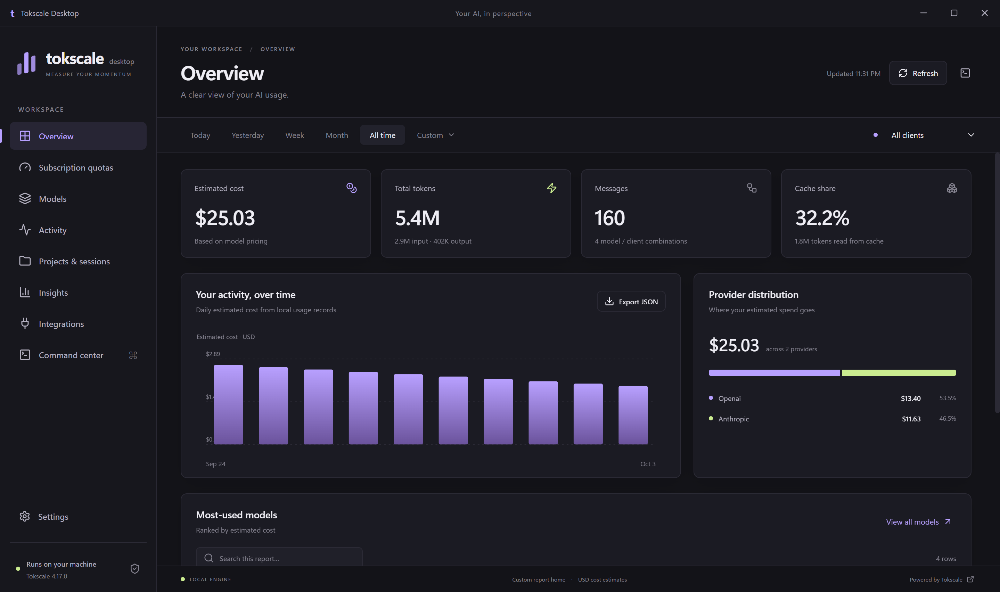
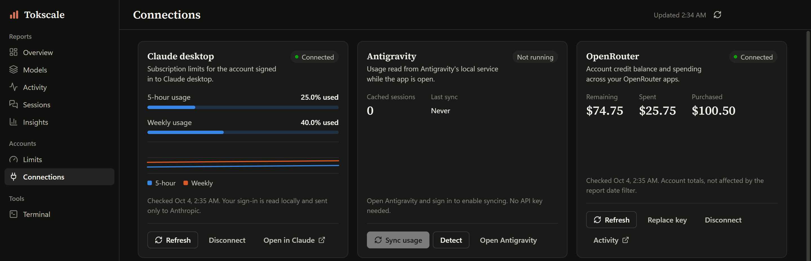

# Tokscale Desktop

This fork adds a Windows desktop application to Tokscale. It uses the original native Tokscale engine for reports, quotas, integrations, and interactive commands. The upstream CLI and source remain available in their original locations.

The application runs in a Windows window and loads its interface from bundled files. It does not need a browser, a local HTTP server, a Tokscale account, or a cloud database to view local reports. Provider quota requests and price lookups retain Tokscale's existing network behavior.



## Desktop views

The sidebar groups pages as Reports, Accounts and Tools, with Settings at the bottom. Report pages share one filter row: Today, Yesterday, 7 days, Month, All time, a Custom date range or calendar year, and a client selector. The header shows when the data was last refreshed.

| Group | Page | What is available |
| --- | --- | --- |
| Reports | Overview | Estimated cost, tokens, messages and cache share; daily cost or token chart that can be stacked by model, provider or client; cost by provider; token mix across all five buckets; top models. Selecting a day narrows the whole app to that day; selecting a provider or model opens Models searched for it |
| Reports | Models | All six groupings, searchable and sortable rows, expanded source fields, worktree merging, JSON export |
| Reports | Activity | Daily, hourly and monthly reports with a chart and table, filtered by date and client. The daily chart can be stacked by model, provider or client, and selecting a day narrows the whole app to that day |
| Reports | Sessions | Sessions / Workspaces toggle; saved Codex and Claude chat names; searchable rows with expandable details; folder aggregates with optional worktree merging |
| Reports | Insights | Activity calendar (tokens, cost or messages), active days, daily token average, largest day, active-time measurements, per-day model breakdown |
| Accounts | Limits | Claude desktop and OpenRouter cards, plus the original engine's provider quota data with reset times, account labels, credits and spending controls when returned |
| Accounts | Connections | Claude desktop, Antigravity and OpenRouter cards, local client discovery, and account and import commands that open in Terminal |
| Tools | Terminal | Original interactive TUI, editable CLI arguments, a Commands list built from the engine's own help, native terminal fallback |
| | Settings | Theme picker (System plus 15 themes: Dark, Light, OLED black and twelve more dark and light palettes), refresh interval, default date range, report home folder, limit notifications, keep running in the tray, launch at login, mini window switch and theme, version and engine information |

Version 0.4 is a redesign of the interface. Pages are renamed and grouped (Limits was Subscription quotas, Sessions was Projects & sessions, Connections was Integrations, Terminal was Command center). The window uses the native Windows title-bar buttons, and the window theme follows the Appearance setting. The earlier custom title bar, breadcrumb, footer bar and filter summary bar are replaced by one header row and one filter row. Titles and headline figures use Source Serif 4; everything else uses Segoe UI. Sessions has a Sessions / Workspaces toggle; all six groupings remain on Models. Terminal fills the page, and its Commands popover lists the engine's commands from its own `--help`. Export results appear as short toast notices instead of dialog boxes. The minimum window size is 960 by 640.

Keyboard shortcuts: Ctrl+K opens Terminal, Ctrl+R refreshes the current report page, Ctrl+, opens Settings, and Ctrl+1 to Ctrl+8 open Overview, Models, Activity, Sessions, Insights, Limits, Connections and Terminal in that order.

Behavior carried over from earlier versions: Sessions starts with sessions, and saved Codex names come from the local read-only index, using the current name before the initial title. Claude names come from metadata the transcripts already store (a custom title first, then a generated title, then a summary); message text is never used. Sessions without saved names show as untitled. Custom dates apply only after validation, and the selected dates are shown in the filter row. Overview exposes every token bucket; Insights preserves calendar gaps and computes the daily average across the recorded calendar span.

### Click-through filtering and stacked charts

Selecting a bar in a daily chart on Overview or Activity narrows every report page to that day. A chip in the filter row ("<date> only") restores the previous date range. The Stack by select on those charts offers None, Model, Provider and Client; the chart shows a legend and a per-segment tooltip, and a model, provider or client keeps the same colour across all bars. The six largest entries get their own colour and the rest are grouped as Other. Hourly and monthly charts are not stacked. When stacked by client, selecting a client in the legend sets the client filter. Selecting a model or provider on Overview opens Models with that name in the search box, because the engine can filter only by client and date.

### Tray, limit notifications, mini window and launch at login

While the app runs, a tray icon shows the current usage limits in its tooltip and menu, grouped by provider. The limits come from the connected Claude desktop account and the engine's own quota report, and are checked every 5 minutes. A notification appears when a limit passes 75% or 90% and when it resets. Turn this off with **Limit notifications** in Settings. The tray menu also has Open Tokscale, Mini window and Quit.

By default, closing the window quits the app. Turn on **Keep running in the tray** to hide the window instead; click the tray icon to bring it back. **Launch at login** starts the app with Windows, hidden in the tray. It applies only to a packaged build, not to a development run, and is registered for the executable you launched.

The mini window is a resizable always-on-top window with today's estimated cost, tokens and messages across all recorded clients, plus every available provider percentage limit from the shared tray monitor. Drag its background or summary to move it; buttons, resize edges and the scrollable limits panel remain interactive. It starts at 300 by 230, has a 280 by 230 minimum, and remembers its size and position while recovering from disconnected monitors. Wider sizes use two limit columns. Totals refresh every minute while visible; limits share cached requests and show their own check time and incomplete-refresh notices. Open it from **Show mini window** in Settings or from the tray menu. **Open widget on startup** defaults on independently of the last visible state, so closing it does not disable the next startup. **Mini window theme** defaults to "Same as main window".

Version 0.4.3 adds **Show widget when AI apps open**, enabled by default. While Tokscale runs, the widget appears when Codex, Claude, or ChatGPT desktop starts or regains focus, without taking keyboard focus away. A hidden Windows helper checks process and foreground-window metadata every 1.5 seconds; it does not inspect chats or credentials. Codex's Store package is recognized even though its executable is named ChatGPT.exe, and CLI helpers are excluded. Enable **Keep running in the tray** and **Launch at login** to make this available after closing the main window and after Windows sign-in. Closing the widget hides it until the next supported app activation; turning off the setting stops detection.

Version 0.4.4 restores dragging by explicitly inheriting the drag-region style on ordinary descendants and limiting the scrolling panel's exclusion to its fixed viewport. Drag the header, summary, or background to move it; buttons and the limits panel retain normal interaction even after scrolling. Windows smoke checks verify the native hit-test results at compact and expanded sizes with the limits scrolled to both ends, rather than checking only the parent CSS.

### Original Tokscale repository updates

Version 0.4.2 checks the original `junhoyeo/tokscale` repository at startup and hourly while the app is running, including in the tray. The first successful check establishes a baseline; a later default-branch change produces one Windows notification linking to the GitHub comparison. Multiple commits between checks produce one notice. The latest detected commit is remembered across restarts, so unchanged code does not keep raising notifications.

**Upstream updates** in Settings has an enabled-by-default notification switch, **Check now**, the last successful check time, and **View changes**. Requests are read-only, require no GitHub key, share cached checks, and back off when offline or rate limited. These notifications do not merge upstream code or update the desktop app or bundled engine. Enable **Keep running in the tray** for checks after closing the main window, and **Launch at login** for checks after signing in to Windows. Checks stop when the app quits.

## Connect Claude desktop, Antigravity, and OpenRouter

Open **Connections** for the connection cards. Connected Claude desktop usage and OpenRouter balances also appear under **Limits**.

- **Claude desktop:** sign in to the existing Claude app, then click **Connect Claude desktop**. The desktop addition recognizes direct-download and Microsoft Store profiles, unlocks the existing OAuth cache with Windows DPAPI in memory, and queries Anthropic's subscription usage endpoint. No Claude Code helper or copied credential file is required. It also reads `plan-usage-history.json` and displays saved utilization snapshots for the latest organization. This is quota history; transcript token accounting remains handled by the original engine. Disconnect stops automatic desktop usage requests without signing out of Claude.
- **Antigravity:** open and sign in to Antigravity, click **Detect**, then **Sync usage**. These buttons invoke the original engine's status and sync commands directly. Its local service also supplies subscription quotas when available. No separate API key is required.
- **OpenRouter:** create a management key using the card's link, paste it into the masked field, and click **Connect OpenRouter**. The app reads purchased credits, total spending, and remaining credits from `GET /api/v1/credits`; ordinary inference keys cannot access this account endpoint. The key is verified before being saved, encrypted through Electron's Windows credential protection, and removed from this app when disconnected. The app does not change OpenRouter keys or billing settings.

Claude desktop and OpenRouter account readers are additions in this fork; the original Tokscale engine remains unchanged. Desktop storage and subscription endpoints are not stable public contracts, so errors remain visible and reconnecting may be necessary after provider updates. Claude rate-limit responses trigger a cooldown. No desktop reader refreshes or modifies Claude's own sign-in files.

The Windows Claude storage layout was checked against the installed app and its live usage endpoint. See the [Claude Account Switcher description](https://github.com/SnlperStripes/claude-account-switcher#how-it-works) for corroborating storage details and [OpenRouter's account credits reference](https://openrouter.ai/docs/api/api-reference/credits/get-remaining-credits) for the management-key requirement.

The screenshot contains invented activity, not a real user's usage. The application discovers local activity when opened normally.



## Build and run

Node.js is required to develop the desktop package. Rust and Bun are needed only when rebuilding or developing the upstream engine; the desktop package bundles the published Windows engine.

```powershell
cd packages/desktop
npm install --workspaces=false
npm run build
npm start
```

Build a portable application or a Windows installer:

```powershell
npm run package
npm run package:installer
```

The generated files are in `packages/desktop/release`. The portable application can run without installation.

The packaged application targets Windows x64. Builds are unsigned.

## Verification

```powershell
npm test
npm run smoke
```

The smoke command generates isolated Codex and Claude sessions and checks the actual Electron renderer, native engine, and embedded PTY. Its report and screenshots are saved to a temporary folder printed on completion. The fixture's Tokscale settings disable every engine usage provider, because some providers read sign-ins from the Windows Credential Manager, which a fixture home cannot redirect. The Limits check is therefore strict: it fails if any quota meter appears. The smoke command exercises totals, client filters, all six groupings, views, saved themes, the mini window, successive commands, and the original TUI's rendering, resizing, keyboard input, persistence during navigation, and shutdown. It also checks renderer isolation and rejected non-HTTP external URLs.

To verify a packaged executable, supply an output folder, the generated fixture home, and the executable path to `npm run smoke -- OUTPUT HOME EXE`. The final portable build was checked with the same UI and terminal smoke checks. The focused test suite checks literal CLI argument handling, errors, timeout/cancellation, bounded output, exports, IPC validation, and the upstream report contracts.

## Original functionality

The desktop package pins the native engine version in its own `package.json`. It does not modify the upstream engine, its parsers, or its provider integrations. The original interactive terminal remains available inside the application, and the original CLI can also be launched in a native terminal. Advanced command arguments are passed directly to Tokscale rather than being interpreted by a command shell.

Use Tokscale's original help for the complete command syntax and supported options. The upstream [README](README.md) describes account integration, reports, data locations, exports, imports, and optional social features.

Local usage reports and subscription quotas are different kinds of data. Token and estimated cost reports are calculated from activity that Tokscale can read. Quotas depend on the provider and available authentication. Empty quota output does not prove that the account has no limits: the upstream engine can omit failed provider queries from its JSON output.

Some upstream capabilities are exposed through the embedded original terminal rather than individual desktop controls, including detailed session metadata, minute reports, task summarization, imports, social features, and automation. A custom report home applies to local reports; the upstream TUI and integration commands do not support that override. Hourly JSON currently omits reasoning tokens, so its token figures are labeled as partial; overview and model totals retain reasoning tokens.

Uploading data, signing in, enabling automatic submissions, and deleting submitted data are explicit actions. Opening the desktop application does not submit local usage to the social platform.

## Updating

Keep desktop changes in `packages/desktop` so they are easy to inspect when updating from `junhoyeo/tokscale`. Update the pinned engine package deliberately, check the JSON contracts, and verify reports and the interactive terminal before packaging a new desktop build.

The upstream GitHub Actions workflows still belong to Tokscale's existing release process. This fork does not use them to publish the desktop package.

## License

Tokscale and this desktop addition use the repository's [MIT license](LICENSE). The bundled dependencies retain their respective licenses. The desktop app icon is Tokscale's original mark. The Source Serif 4 typeface is bundled from the `@fontsource-variable/source-serif-4` development dependency, which `scripts/build.mjs` emits into `dist-renderer`, and is licensed under the SIL Open Font License 1.1. Segoe UI is used from the system and is not bundled.
