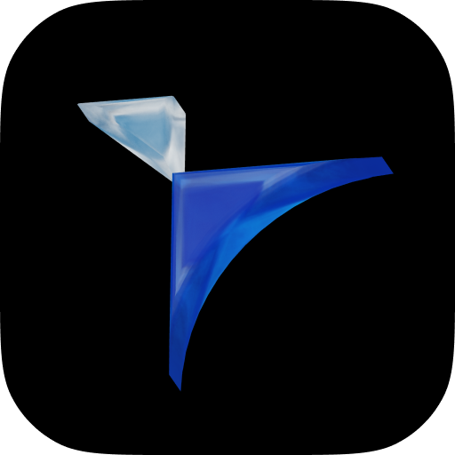

<div align="center">



# Tokscale Desktop

**See what your AI coding tools cost, and how close you are to your limits, from a native Windows app.**

[Download for Windows](https://github.com/Subterfugus/tokscale-desktop/releases/latest) · [Desktop guide](DESKTOP.md) · [Original Tokscale CLI](https://github.com/junhoyeo/tokscale)

</div>


Tokscale Desktop reads the usage logs that Codex, Claude Code, Cursor, OpenCode and other AI coding tools already keep on your computer, and turns them into cost and token reports. It also shows your plan limits, with a small always-on-top widget for keeping an eye on them while you work.

The data stays on your machine. The app shows reports and limits from local logs and from the account connections you choose to make.

## Features

- **Reports.** Overview, Models, Activity, Sessions, and Insights, with one shared date filter and client selector. Charts can be stacked by model, provider, or client.
- **Limits.** Usage limits from your connected accounts, with reset times and pace. A notification fires at 75% and 90%, and again when a limit resets.
- **Mini window.** A compact widget with today's totals and your limits. It can shrink to a movable bubble, is see-through at a setting you choose, and can appear when Codex, Claude, or ChatGPT opens.
- **Tray and launch at login.** Keep the app running in the tray and start it with Windows.
- **Themes.** Fifteen themes, including light, dark, OLED black and a pink option.
- **Built-in terminal.** The original Tokscale interactive interface, for anything the reports don't cover.
- **Updates.** The app checks for new releases and installs them with one click.


## Install

1. Download `Tokscale-Desktop-<version>-x64.exe` from the [latest release](https://github.com/Subterfugus/tokscale-desktop/releases/latest).
2. Run it. The app is portable and needs no installer.
3. Windows may show a warning that the publisher is unknown, because this build is not code-signed. Choose **More info**, then **Run anyway**.

A 64-bit version of Windows is required. Nothing else needs to be installed for the reports to work.

## Connecting accounts

Connections are optional. Reports work from local logs alone.

- **Claude desktop:** sign in to the Claude app, then connect it under **Connections**. The app reads the sign-in it already stores on your computer and makes read-only usage requests.
- **OpenRouter:** paste a management key in **Connections**. It is encrypted with Windows credential protection and stays on this computer.
- **Antigravity:** detected and synced from its local service.

Disconnecting removes the saved key or stops the requests. It doesn't sign you out of anything.

## Building from source

Node.js is needed for the desktop package. The engine it bundles is the published Windows build of Tokscale, so Rust is only needed if you change the engine itself.

```powershell
cd packages/desktop
npm install --workspaces=false
npm run build
npm test
npm run package
```

The portable executable is written to `packages/desktop/release/`. See [DESKTOP.md](DESKTOP.md) for the full list of commands and the smoke test.

## Credits

Tokscale Desktop is a fork of [junhoyeo/tokscale](https://github.com/junhoyeo/tokscale), which provides the usage engine, the CLI, and the TUI. The fork adds the Windows application in `packages/desktop`. The original project's documentation and CLI remain at its own repository.

Licensed under the [MIT License](LICENSE).
